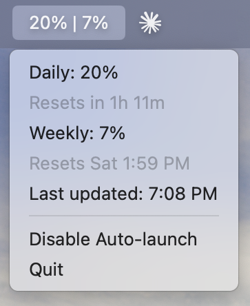

# Claude Bar

A lightweight macOS menu bar app that shows your Claude.ai usage at a glance.



```
42% | 7%
─────────────────
Daily: 42%
Resets in 3h 20m
─────────────────
Weekly: 7%
Resets Sat 2:00 PM
─────────────────
Last updated: 3:45 PM
Disable Auto-launch
Quit
```

## Requirements

- macOS
- Python 3
- Chrome logged in to [claude.ai](https://claude.ai)

## Installation

```bash
git clone https://github.com/your-username/claude-bar.git
cd claude-bar
pip3 install -r requirements.txt
```

Then register it to launch at login:

```bash
cp com.claudebar.plist ~/Library/LaunchAgents/
launchctl load ~/Library/LaunchAgents/com.claudebar.plist
```

Or run it manually:

```bash
python3 app.py
```

## How it works

1. Reads your `sessionKey` cookie from Chrome (no passwords stored)
2. Calls the Claude.ai API to fetch your org's usage data
3. Displays daily and weekly utilization in the menu bar
4. Refreshes every 5 minutes in the background

## Uninstall

Click **Disable Auto-launch** in the menu bar app — it unloads the LaunchAgent and removes the plist automatically. Then quit the app and delete the project folder.

Or manually:

```bash
launchctl unload ~/Library/LaunchAgents/com.claudebar.plist
rm ~/Library/LaunchAgents/com.claudebar.plist
```
